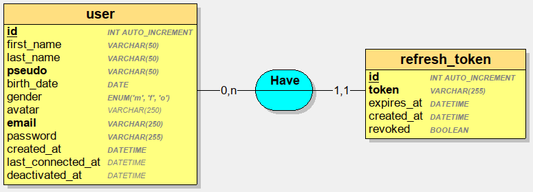

# RESTful-like API en PHP natif

## Avant-propos

Ce projet à vocation pédagogique illustre une mise en œuvre simplifiée en PHP natif d'une API respectant en partie les
contraintes architecturales REST.

Pour plus de détails sur les contraintes architecturales en
question : [Representational state transfer — Wikipédia](https://fr.wikipedia.org/wiki/Representational_state_transfer#Contraintes_architecturales).

## Spécificités

- Implémentation en PHP natif sans dépendances tierces.
- Organisation selon un modèle en couches _Model_/_Controller_, le contrôleur étant en charge de la génération des
  réponses au format JSON.
- Gestion des erreurs personnalisées et journalisation des exceptions.
- Exemples d'opérations standards sur un jeu de données (modèle `User`) :
    - GET
    - POST
    - PUT
    - PATCH
    - DELETE
- Authentification via _JSON Web Token_ (JWT), voir :
  - [JSON Web Token — Wikipédia](https://fr.wikipedia.org/wiki/JSON_Web_Token)
  - [RFC 6750 - The OAuth 2.0 Authorization Framework: Bearer Token Usage](https://datatracker.ietf.org/doc/html/rfc6750)

## Modèle conceptuel des données

MCD des entités `user` et `refresh_token` avec spécification des types MySQL.



## _Endpoints_ disponibles

### Modèle `User`

- Récupération de tous les utilisateurs :

    ```shell
    GET /api/user
    ```

- Récupération d'un utilisateur en fonction de son identifiant (`user.id`) :

   ```shell
   GET /api/user/{id}
   ```

- Création d'un nouvel utilisateur :

    ```shell
    POST /api/user/{id}
    ```

- Modification d'un utilisateur :

    ```shell
    PATCH /api/user/{id}
    ```

- Remplacement d'un utilisateur :

    ```shell
    PUT /api/user/{id}
    ```

- Suppression d'un utilisateur en fonction de son identifiant (`user.id`) :

    ```shell
    DELETE /api/user/{id}
    ```

### Authentification JWT

- Connexion :

    ```shell
    POST /api/user/login
    ```

- Déconnexion :

    ```shell
    POST /api/user/logout
    ```

- Reconnexion (rafraîchissement du jeton d’accès) :

    ```shell
    POST /api/user/token/refresh
    ```

## Structure du projet

Arborescence des répertoires et sous-répertoires :
```console
├── public
│   ├── assets
│   ├── client.php
│   ├── front_controller.php
│   └── index.php
├── src
│   ├── Core
│   │   ├── Database.php
│   │   └── DotEnv.php
│   ├── Security
│   │   └── JwtService.php
│   ├── Controller
│   │   └── UserController.php
│   └── Model
│       └── User.php
├── helpers
│   ├── global_helper.php
│   ├── http_response_helper.php
│   └── jwt_helper.php
├── logs
└── stuff

```

Détails :
- `/public`: Point d'accès public (assets, client jQuery), initialisation des variables d'environnement (`.env` : connexion à la base de données, configuration JWT) et chargement des composants nécessaires (`index.php`), et contrôleur frontal (`front_controller.php`, en charge du routage via l'analyse du format des requêtes ainsi que de la méthode (GET, POST, PATCH, etc.) utilisée par la requête).
- `/src/Core`: Composants du cœur applicatif.
- `/src/Security`: Composants de sécurité (JWT).
- `/src/Controller`: Implémentation de la logique (analyse des requêtes, application des traitements, élaboration des réponses).
- `/src/Model`: Implémentation des opérations en base de données. 
- `/helpers` : Scripts utilitaires.
- `/logs` : Destiné au stockage des fichiers de journalisation (ex. : `error.log`), ce dossier doit être créé manuellement (voir plus bas).
- `/stuff` : Fichiers et documents annexes.


## Installation du projet

### Pré-requis

- PHP 8.1 ou version supérieure.
- MySQL 8.0  ou version supérieure.
- Git.

### Déploiement

1. Clonage du dépôt GitHub :

    ```
    git clone git@github.com:El-Profesor/Native-PHP-RESTful-API.git native_php_restful_api
    ```

2. Création de la base de données :
   - Créer une base de données nommée `native_php_restful_api` (par exemple).
   - Importer le script de création de la base de données (fichier `/stuff/native_php_restful_api.sql`).

3. Configuration des paramètres de connexion à la base de données et des paramètres JWT (le fichier `/.env` doit être créé manuellement) :

   ```env
    DB_HOST=localhost
    DB_USER=
    DB_PASS=
    DB_NAME=native_php_restful_api

    JWT_SECRET=my_secret_key_not_really_so_secret_please_change_me
    JWT_TTL=300
    JWT_REFRESH_TTL=604800
    ```

4. Création d'un fichier de journalisation (_logging_) destiné à conserver une trace des exceptions PHP générées par l'application, avec **permissions suffisantes** (accès en écriture) :
   ```shell
   cd native_php_restful_api
   mkdir logs
   touch logs/error.log
   chmod 777 logs/error.log
    ```

5. Démarrage du serveur Web interne à PHP :

    ```shell
    cd native_php_restful_api
    php -S localhost:8000 -t public
    ```

6. Vérification du fonctionnement de l'application via un client HTTP (ex. : navigateur) : http://localhost:8000/api/user.

7. Vérification du fonctionnement du client jQuery via un navigateur : http://localhost:8000/client.php.

## Gestion des erreurs

### Codes de réponses HTTP de l'API

Liste des codes utilisés (non exhaustive) :
- **400** - _Bad Request_ : Le corps de la requête est vide ou des données requises sont manquantes.
- **401** - _Unauthorized_ : L'utilisateur n'est pas authentifié.
- **403** - _Forbidden_ : L'accès à la ressource demandée est interdit.
- **404** - _Not Found_ : La route ou l'instance d'un modèle n'ont pu être trouvés.
- **405** - _Method Not Allowed_ : La méthode utilisée par la requête (GET, POST, PATCH, etc.) n'est pas autorisée.
- **500** - _Internal Server Error_ : Il s'agit d'une erreur interne du serveur non spécifiée.
- Etc.

Les codes d'état et messages associés (succès ou erreur) sont inclus à la réponse au format JSON afin de pouvoir traiter les cas particuliers côté client.

Pour le détail des codes d'état de réponse HTTP, voir : [Liste des codes HTTP — Wikipédia](https://fr.wikipedia.org/wiki/Liste_des_codes_HTTP).

### Error Log

Toutes les exceptions PHP générées côté serveur sont journalisées dans le fichier `/logs/error.log`.

Ce fichier permet la surveillance de l'application en fonctionnement et constitue une aide pour l'identification de l'origine des exceptions PHP générées.

## Avertissement

Ce dépôt a été conçu à des fins pédagogiques pour illustrer des concepts et des principes spécifiques. Le code n'est pas destiné à être utilisé en production, car il peut ne pas répondre aux exigences de sécurité, de qualité, de robustesse et de performance nécessaires dans un environnement professionnel. Il sert uniquement à des fins d'apprentissage et ne doit pas être considéré comme un modèle de développement. Ce code est donc fourni à des fins éducatives et sans engagement de performance ou de fiabilité.

## License

Ce projet inspiré du projet [FarrelAD/Basic-PHP-RESTful-API](https://github.com/FarrelAD/Basic-PHP-RESTful-API) est open source et disponible sous licence MIT. N’hésitez pas à le modifier et à l’utiliser comme support d’apprentissage.